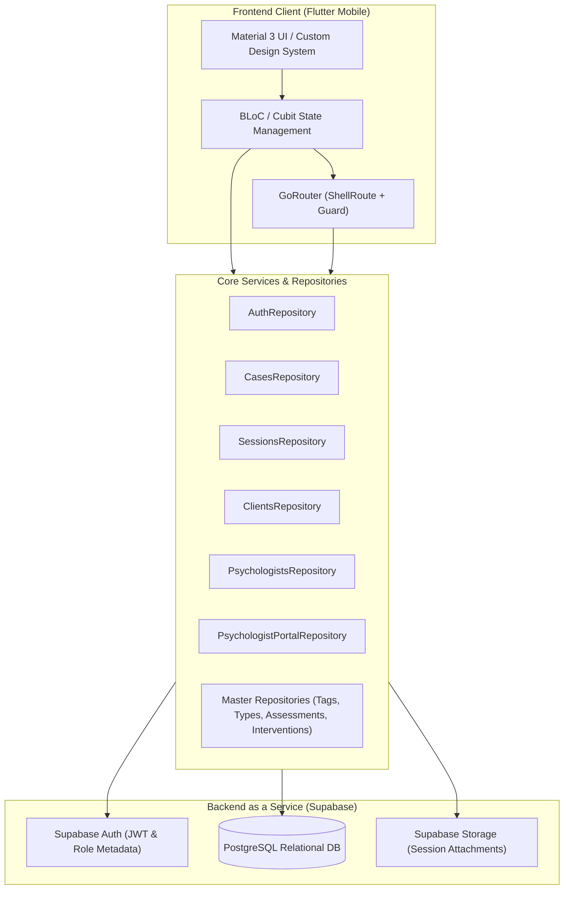
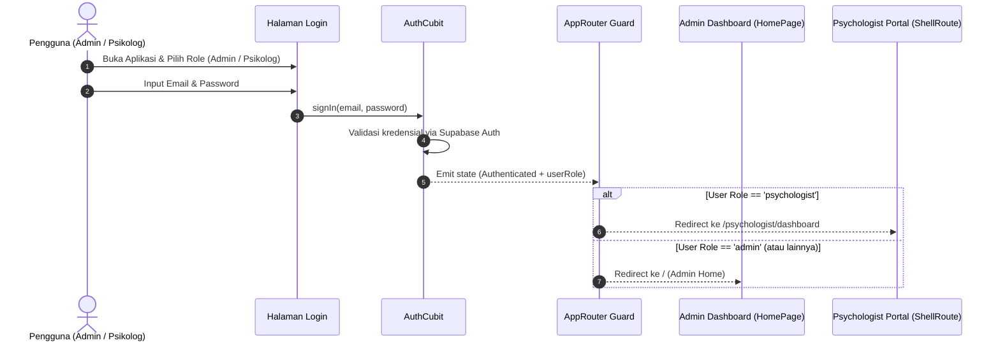
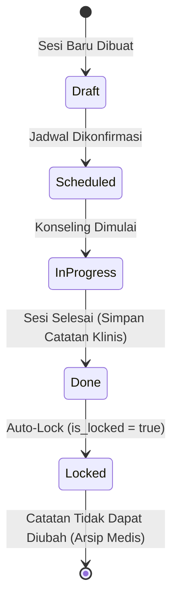
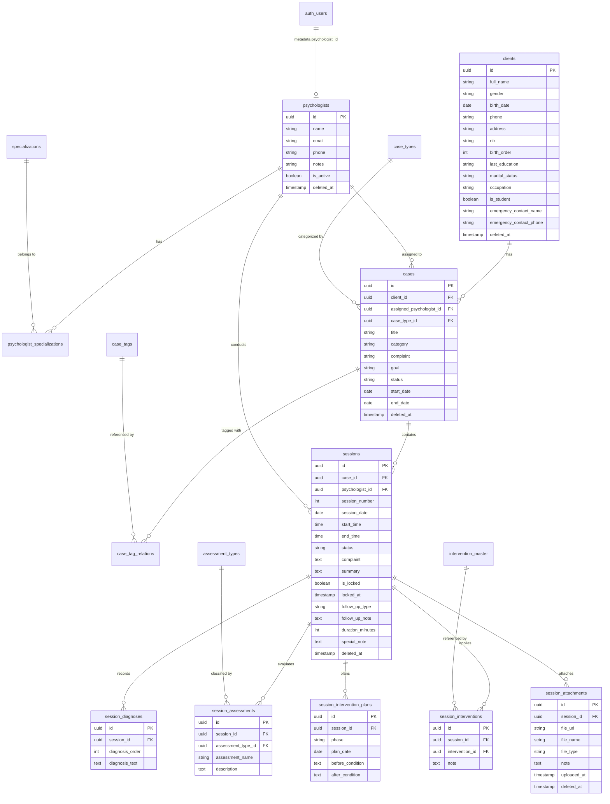

# Sesi Ira - Clinical Counseling & Case Management System

**Sesi Ira** adalah platform mobile terintegrasi berbasis Flutter dan Supabase yang dirancang khusus untuk mendigitalkan manajemen kasus konseling, asesmen klinis, intervensi psikologis, dan penjadwalan sesi antara pihak manajemen klinik (**Admin**) dan praktisi psikologi (**Psikolog**).

Aplikasi ini mengadopsi prinsip arsitektur modular (*Feature-First*), kontrol akses berbasis peran (*Role-Based Access Control / RBAC*), serta integritas data rekam medis dengan sistem penguncian sesi (*Session Locking Workflow*).

---

## Daftar Isi
1. [Deskripsi Arsitektur High-Level](#1-deskripsi-arsitektur-high-level)
2. [Tech Stack & Pustaka Utama](#2-tech-stack--pustaka-utama)
3. [State Management & Arsitektur Kode](#3-state-management--arsitektur-kode)
4. [Multi-Role & Alur Kerja Aplikasi (App Flow)](#4-multi-role--alur-kerja-aplikasi-app-flow)
5. [Skema Database & Relasi Entitas (ERD)](#5-skema-database--relasi-entitas-erd)
6. [Struktur Folder & File yang Disediakan](#6-struktur-folder--file-yang-disediakan)
7. [Panduan Konfigurasi & Menjalankan Aplikasi](#7-panduan-konfigurasi--menjalankan-aplikasi)

---

## 1. Deskripsi Arsitektur High-Level

Sesi Ira menghubungkan dua domain operasional utama dalam satu aplikasi:
- **Admin Portal**: Bertanggung jawab atas pengelolaan data master (kategori kasus, tag, tipe asesmen, intervensi), registrasi klien, manajemen profil dan akun login psikolog, penugasan kasus (*case assignment*), serta administrasi booking sesi awal.
- **Psychologist Portal**: Lingkungan khusus psikolog untuk memantau agenda harian/bulanan, mengakses rekam jejak klien yang ditugaskan (*assigned clients*), mencatat asesmen diagnostik, merencanakan intervensi bertahap, dan menyelesaikan sesi dengan validasi ketat.



---

## 2. Tech Stack & Pustaka Utama

| Komponen | Pustaka / Teknologi | Versi | Fungsi / Kegunaan |
| :--- | :--- | :--- | :--- |
| **Framework** | Flutter (Dart SDK) | `^3.11.1` (Dart 3) | Kerangka kerja aplikasi cross-platform. |
| **Design System** | Material Design 3 | Bawaan Flutter | Komponen antarmuka modern dengan *dynamic styling*. |
| **Backend & DB** | `supabase_flutter` | `^2.12.2` | Klien Postgres, autentikasi, dan relasi multi-tabel. |
| **State Management** | `flutter_bloc`, `bloc` | `^9.1.1` / `^9.2.0` | Mengelola aliran data reaktif dan *business logic*. |
| **Value Equality** | `equatable` | `^2.0.8` | Membandingkan state objek tanpa boilerplate `==` dan `hashCode`. |
| **Routing & Navigasi** | `go_router` | `^17.2.1` | Deklaratif routing, dynamic parameters, nested `ShellRoute`, dan route guard. |
| **Formatting & Waktu** | `intl`, `timezone` | `^0.20.2` | Penanganan waktu 24 jam (`alwaysUse24HourFormat: true`) & lokalisasi. |
| **Notifikasi Lokal** | `flutter_local_notifications` | `^21.0.0` | Pengingat sesi dan agenda konseling lokal. |
| **File & Media** | `image_picker`, `file_picker` | `^1.2.1` / `^11.0.2` | Pengunggahan dokumen atau lampiran catatan sesi klinis. |
| **Identifier** | `uuid` | `^4.5.3` | Pembuatan ID unik lokal untuk transaksi dan upload file. |

---

## 3. State Management & Arsitektur Kode

Aplikasi menerapkan pola **Feature-First Architecture** dikombinasikan dengan **BLoC/Cubit Pattern**:

### Pola Manajemen State:
1. **Global Auth State (`AuthCubit` & `AuthViewState`)**:
   - Mendengarkan perubahan sesi Supabase Auth (`authStateChanges`).
   - Menyimpan informasi pengguna aktif, peran (`userRole`: `admin` atau `psychologist`), dan referensi ID psikolog (`psychologistId`).
   - Menangani siklus login, logout, dan perpindahan peran login pada UI (`selectLoginRole`).
2. **Sinkronisasi Routing Reaktif (`RouterRefreshNotifier`)**:
   - `RouterRefreshNotifier` meneruskan stream perubahan state dari `AuthCubit` langsung ke `GoRouter`.
   - Menjamin bahwa jika token kedaluwarsa atau pengguna logout, guard langsung mengarahkan rute kembali ke `/login`.
3. **Repository-Driven Data Layer**:
   - Lapisan repository bertanggung jawab penuh atas agregasi data, join query Supabase, dan mapping model DTO (*Data Transfer Object*).
   - Layar presentasi mengonsumsi data via `FutureBuilder` yang dilengkapi state interaktif: *Loading indicator*, *Error view dengan tombol retry*, *Empty state*, dan *Pull-to-refresh (`RefreshIndicator`)*.

---

## 4. Multi-Role & Alur Kerja Aplikasi (App Flow)



### A. Alur Kerja Admin (Admin Workflow)
1. **Setup Data Master**:
   - Admin mendefinisikan *Case Types* (misal: Individual, Pasangan, Remaja), *Case Tags* (misal: Anxiety, Depresi, Karier), *Assessment Types* (BDI, DASS-21, dsb.), dan *Intervention Master* (CBT, Mindfulness, Behavior Activation).
2. **Manajemen Psikolog**:
   - Admin menambahkan profil psikolog baru, menetapkan spesialisasi, dan secara otomatis membuatkan akun login Supabase dengan metadata `role: 'psychologist'` dan `psychologist_id`.
3. **Manajemen Klien & Kasus**:
   - Pendaftaran data klien (identitas, kontak darurat, status pelajar/pekerja).
   - Pembuatan kasus (`cases`) dengan menghubungkan klien, tipe kasus, tag yang relevan, serta menugaskan psikolog penanggung jawab (`assigned_psychologist_id`).
4. **Penjadwalan Sesi**:
   - Menambahkan sesi baru di dalam kasus. Nomor sesi dihitung otomatis secara inkremental (`session_number = max + 1`).

---

### B. Alur Kerja Portal Psikolog (Psychologist Portal Workflow)
1. **Navigasi Persisten (`PsychologistPortalShell`)**:
   - Menggunakan `ShellRoute` dengan navigasi bawah (Beranda, Klien, Kasus, Jadwal, Profil) yang menjaga konsistensi state UI.
2. **Dashboard & Jadwal**:
   - Psikolog melihat ringkasan sesi mendatang, agenda kalender, dan notifikasi pengingat.
3. **Daftar Klien Dinamis**:
   - Klien yang muncul hanya yang kasusnya ditugaskan ke psikolog tersebut (`cases.assigned_psychologist_id == auth.psychologist_id`).
   - Kalkulasi otomatis umur klien, jumlah kasus terkait, serta kalkulasi waktu relatif dari sesi terakhir (*"Last session 3 hari lalu"*).
4. **Pencatatan Sesi Klinis & Siklus Penguncian (*Session Locking*)**:


- Sesi yang sudah berstatus `done` secara otomatis dikunci (`is_locked: true`) untuk menjaga integritas catatan rekam medis psikologi.

---

## 5. Skema Database & Relasi Entitas (ERD)

Aplikasi menggunakan arsitektur relasional pada database PostgreSQL Supabase:



---

## 6. Struktur Folder & File yang Disediakan

```text
lib/
├── app.dart                                # Konfigurasi MaterialApp, tema, dan AppRouter
├── main.dart                               # Entry-point aplikasi & inisialisasi Supabase
│
├── core/                                   # Komponen global & utility yang dipakai lintas fitur
│   ├── config/
│   │   └── supabase_config.dart            # Konstanta konfigurasi Supabase (URL & Anon Key)
│   ├── error/
│   │   ├── app_exception.dart              # Custom exception domain aplikasi
│   │   └── supabase_error_helper.dart      # Parser pesan error PostgREST / Supabase
│   ├── router/
│   │   ├── app_router.dart                 # Konfigurasi GoRouter, route tree, dan guard RBAC
│   │   └── router_refresh_notifier.dart    # Jembatan reactive refresh BLoC Stream ke Router
│   ├── services/
│   │   └── supabase_service.dart           # Singleton wrapper klien Supabase
│   └── widgets/                            # Reusable widgets (form fields, chips, divider, dll.)
│       ├── app_form_fields.dart
│       ├── dashed_line.dart
│       ├── feature_support_widgets.dart
│       ├── form_section_label.dart
│       ├── image_picker_placeholder_field.dart
│       └── multi_select_chip_group.dart
│
└── features/                               # Modul berbasis fitur (Feature-First)
    ├── auth/                               # Fitur Autentikasi & Profil Pengguna
    │   ├── data/repositories/auth_repository.dart
    │   └── presentation/
    │       ├── cubit/                      # AuthCubit & AuthViewState
    │       └── pages/                      # LoginPage, HomePage, ProfilePage
    │
    ├── clients/                            # Fitur Manajemen Data Klien
    │   ├── data/models/client_model.dart
    │   ├── data/repositories/clients_repository.dart
    │   └── presentation/pages/             # ClientsPage, CreateClientPage
    │
    ├── psychologists/                      # Fitur Manajemen Praktisi Psikolog
    │   ├── data/models/                    # PsychologistModel, SpecializationModel
    │   ├── data/repositories/psychologists_repository.dart
    │   └── presentation/pages/             # PsychologistsPage, CreatePsychologistPage
    │
    ├── cases/                              # Fitur Manajemen Kasus & Taksonomi Kasus
    │   ├── data/models/                    # CaseSummaryModel, CaseTypeModel, CaseTagModel
    │   ├── data/repositories/              # CasesRepository, CaseTypesRepository, CaseTagsRepository
    │   └── presentation/pages/             # CasesPage, CreateCasePage, MasterCasePage, CaseTagsPage, dll.
    │
    ├── sessions/                           # Fitur Manajemen Sesi Konseling & Rekam Medis Klinis
    │   ├── data/models/                    # SessionModel, Assessment, Diagnosis, Intervention, Attachment
    │   ├── data/repositories/              # SessionsRepository, AssessmentTypesRepository, InterventionRepo
    │   └── presentation/pages/             # SessionsPage, CreateSessionPage, UpdateSessionPage, MasterSession
    │
    ├── master_data/                        # Menu Hub Navigasi Data Master (Admin)
    │   └── presentation/pages/master_data_page.dart
    │
    └── psychologist_portal/                # Portal Khusus Psikolog (Tampilan Eksklusif)
        ├── data/
        │   ├── psychologist_portal_models.dart      # Data classes preview klien, agenda, kasus
        │   ├── psychologist_portal_repository.dart  # Query relasional klien per psikolog dari Supabase
        │   └── psychologist_portal_mock_data.dart   # Mock fallback untuk prototyping
        └── presentation/
            ├── pages/                      # Dashboard, Clients, Cases, Schedule, Detail Sesi, Notifikasi
            └── widgets/                    # PsychologistPortalShell, Scaffold, BottomNavigation, Tiles
```

---

## 7. Panduan Konfigurasi & Menjalankan Aplikasi

### Kebutuhan Sistem
- **Flutter SDK**: `>= 3.11.1`
- **Dart SDK**: `>= 3.0.0`
- Akun dan Project **Supabase** yang aktif dengan skema tabel di atas.

### Konfigurasi Variabel Lingkungan
Konfigurasi Supabase dapat diatur saat kompilasi (*compile-time*) menggunakan `--dart-define`:
- `SUPABASE_URL`: Endpoint REST URL project Supabase kamu.
- `SUPABASE_ANON_KEY`: Anon/Public API Key project Supabase kamu.

*(Catatan: Nilai default development telah disiapkan pada [supabase_config.dart](file:///Users/m.zulkarnaen/Documents/project_kantor/flutter_project/other_project/sesi_ira/lib/core/config/supabase_config.dart)).*

### Menjalankan Aplikasi

1. **Install dependensi Flutter**:
   ```bash
   flutter pub get
   ```

2. **Jalankan aplikasi di emulator atau perangkat fisik**:
   ```bash
   flutter run --dart-define=SUPABASE_URL="https://your-project.supabase.co" --dart-define=SUPABASE_ANON_KEY="your-anon-key"
   ```

3. **Menjalankan pemeriksaan kode & analisis sintaks**:
   ```bash
   flutter analyze
   ```

4. **Menjalankan test suite**:
   ```bash
   flutter test
   ```

5. **Testing mermaind diagram**
6. **Testing mermaind diagram**